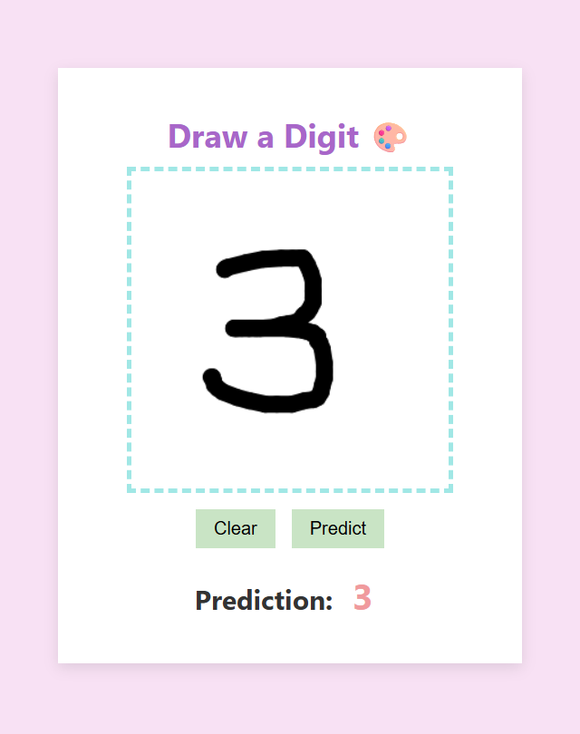

# MNIST Digit Recognizer 🔎

A cute and user-friendly web app that recognizes handwritten digits using a Convolutional Neural Network (CNN) trained on the MNIST dataset. Built with **TensorFlow**, **Flask**, and **JavaScript**, this app allows users to draw digits on a canvas and get instant predictions from the ML model. The front-end features a pastel-themed interface for a more delightful experience.

## ✨ Features

* Draw digits on a responsive canvas (mouse & touch supported)
* Clear and Predict buttons for ease of interaction
* Real-time prediction using a trained CNN model
* Light and aesthetic pastel-colored UI

## 🛠️ Technologies Used

* **Python** (Flask for backend)
* **TensorFlow / Keras** (for training and inference)
* **HTML / CSS / JavaScript** (frontend)
* **PIL / NumPy** (image processing)

## 🎨 UI Preview

A pastel-themed canvas with clear controls and minimal distractions.

  

## 📄 License

This project is open source and available under the [MIT License](LICENSE).
